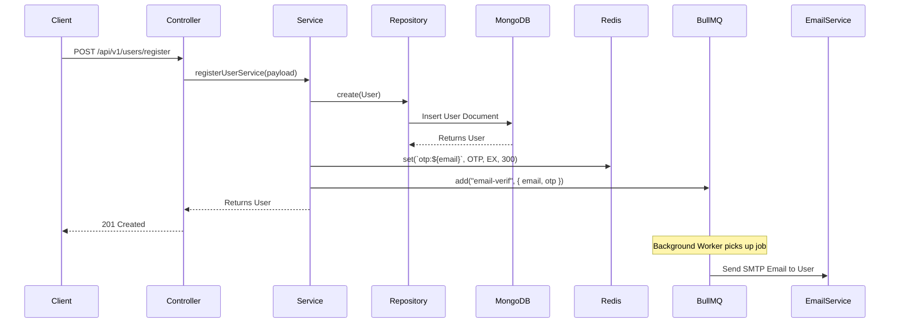

# Auth & Users Modules

## 1. What is it?

The **Auth & Users Modules** act as the identity management and security backbone of the Lattice platform. 
The **Users** module is responsible for managing user accounts, profiles, and basic CRUD operations. 
The **Auth** module is dedicated to security, managing the authentication lifecycle, session tracking, token rotation, and route protection. 

They interact heavily with the **Email** module (to dispatch verification emails via BullMQ background jobs), the **Redis** cache (for short-lived OTPs), and the **Database** (MongoDB for user records and active sessions).

---

## 2. What does it do?

- Registers new user accounts.
- Authenticates existing users with email and password.
- Issues short-lived JWT Access Tokens and secure, opaque Refresh Tokens.
- Rotates refresh tokens to maintain active sessions securely.
- Manages and revokes user sessions upon logout.
- Verifies user emails via Redis-backed OTPs.
- Publishes domain events (`user.created`) for other modules to react.
- Queues background jobs to send verification emails asynchronously.
- Protects private routes by extracting and validating access tokens via middleware.
- Retrieves the currently authenticated user's profile.

---

## 3. Routes

| Method | Route | Description | Authentication Required |
|---------|-------|-------------|-------------------------|
| `POST` | `/api/v1/users/register` | Register a new user | No |
| `POST` | `/api/v1/auth/login` | Log in and receive tokens | No |
| `POST` | `/api/v1/auth/verify-email` | Verify email with OTP | No |
| `POST` | `/api/v1/auth/refresh` | Rotate tokens for active session | No (Requires Refresh Cookie) |
| `POST` | `/api/v1/auth/logout` | Revoke session & clear cookies | No (Uses Refresh Cookie) |
| `GET`  | `/api/v1/users/me` | Fetch authenticated user's profile | Yes |

---

## 4. Route Details

### POST /api/v1/users/register

#### Purpose
Allows new users to create an account on Lattice. It safely hashes their password, stores the user in the database, generates a verification OTP, and queues a background email job.

#### Headers
```http
Content-Type: application/json
```

#### Route Params
None

#### Query Params
None

#### Request Body
```json
{
  "username": "johndoe",
  "email": "john@example.com",
  "password": "securepassword123"
}
```

#### Validation Rules
- `username`: String, min 3, max 12 characters.
- `email`: Valid email format.
- `password`: String, min 6 characters.

#### Success Response
```json
{
  "success": true,
  "message": "User created successfully",
  "data": {
    "userId": "64c8f2b3...",
    "email": "john@example.com",
    "username": "johndoe",
    "profile": {}
  }
}
```

#### Error Responses
- `400 Validation Error`: If the request body fails Zod schema checks.
- `400 Bad Request`: If user creation fails unexpectedly.
- `409 Conflict`: If a user with the provided email already exists.

---

### POST /api/v1/auth/login

#### Purpose
Authenticates users and initiates a secure session. Implements a "Double Cookie" pattern by setting both `accessToken` and `refreshToken` in HTTP-only cookies, while also returning the `accessToken` in the JSON body for maximum client flexibility.

#### Headers
```http
Content-Type: application/json
```

#### Route Params
None

#### Query Params
None

#### Request Body
```json
{
  "email": "john@example.com",
  "password": "securepassword123"
}
```

#### Validation Rules
- `email`: Valid email format.
- `password`: String, min 1 character.

#### Success Response
```json
{
  "success": true,
  "message": "User logged in successfully",
  "data": {
    "user": {
      "userId": "64c8f2b3...",
      "email": "john@example.com",
      "username": "johndoe",
      "profile": {}
    },
    "accessToken": "eyJhbGciOiJIUzI1NiIs..."
  }
}
```
*Note: Includes `Set-Cookie` headers for `refreshToken` and `accessToken`.*

#### Error Responses
- `400 Validation Error`: If request body fails schema checks.
- `401 Unauthorized`: If email or password is incorrect.
- `403 Forbidden`: If the account is inactive or the email has not been verified yet.

---

### POST /api/v1/auth/verify-email

#### Purpose
Verifies a user's email address by validating a short-lived OTP stored in Redis against a verification token.

#### Headers
```http
Content-Type: application/json
```

#### Route Params
None

#### Query Params
None

#### Request Body
```json
{
  "token": "eyJhbGciOiJIUzI1NiIs...",
  "otp": 123456
}
```

#### Validation Rules
- `token`: String, required.
- `otp`: Integer, between 100000 and 999999.

#### Success Response
```json
{
  "success": true,
  "message": "Email verified successfully",
  "data": null
}
```

#### Error Responses
- `400 Validation Error`: If body format is invalid.
- `400 Bad Request`: If the OTP has expired, is invalid, or if the email is already verified.
- `401 Unauthorized`: If the verification JWT token is missing, invalid, or expired.
- `404 Not Found`: If the user corresponding to the token does not exist.

---

### POST /api/v1/auth/refresh

#### Purpose
Provides token rotation. Consumes an existing, valid refresh token to issue a brand new short-lived access token and a brand new refresh token, updating the active session in the database.

#### Headers
```http
Cookie: refreshToken=<opaque-hex-string>
```

#### Route Params
None

#### Query Params
None

#### Request Body
None

#### Validation Rules
None (Validates entirely via cookie presence).

#### Success Response
```json
{
  "success": true,
  "message": "Session refreshed successfully",
  "data": {
    "accessToken": "eyJhbGciOiJIUzI1NiIs..."
  }
}
```
*Note: Includes `Set-Cookie` headers for the newly rotated `refreshToken` and `accessToken`.*

#### Error Responses
- `401 Unauthorized`: If the refresh token is missing, invalid, revoked, expired, or if the associated user account is no longer active.

---

### POST /api/v1/auth/logout

#### Purpose
Terminates an active session. Revokes the refresh token in the database and clears the authentication cookies on the client side.

#### Headers
```http
Cookie: refreshToken=<opaque-hex-string>
```

#### Route Params
None

#### Query Params
None

#### Request Body
None

#### Validation Rules
None

#### Success Response
```json
{
  "success": true,
  "message": "Logged out successfully",
  "data": null
}
```
*Note: Sets `maxAge: 0` for authentication cookies to clear them from the browser.*

#### Error Responses
None. Fails silently if no refresh token is provided.

---

### GET /api/v1/users/me

#### Purpose
Fetches the profile details of the currently authenticated user.

#### Headers
```http
Authorization: Bearer <accessToken> 
# OR via Cookie: accessToken=<accessToken>
```

#### Route Params
None

#### Query Params
None

#### Request Body
None

#### Validation Rules
None

#### Success Response
```json
{
  "success": true,
  "message": "User details fetched successfully",
  "data": {
    "userId": "64c8f2b3...",
    "username": "johndoe",
    "email": "john@example.com",
    "role": "USER",
    "status": "ACTIVE",
    "profile": {},
    "emailVerified": true,
    "createdAt": "2026-08-05T12:00:00Z",
    "updatedAt": "2026-08-05T12:00:00Z"
  }
}
```

#### Error Responses
- `401 Unauthorized`: If the access token is missing, expired (`TOKEN_EXPIRED`), or invalid (`INVALID_TOKEN`).
- `404 Not Found`: If the user no longer exists in the database.

---

## 5. Complete Request Flow

### Login Flow Example

Client
↓
Route (`POST /api/v1/auth/login`)
↓
Validation (`validate.middleware.ts` parses `req.body` using `Zod`)
↓
Controller (`AuthController.login` extracts device/IP info)
↓
Service (`AuthService.loginService` validates credentials and generates tokens)
↓
Repository (`SessionRepository` creates a new session document)
↓
Database (`MongoDB` stores the hashed refresh token and expiration)
↓
Controller (Attaches HTTP-only cookies to the `Response`)
↓
Client (Receives JSON with `accessToken` and HTTP-only cookies)

---

## 6. Internal Architecture

- **`controllers/`**: Handles raw HTTP requests and responses. Parses `req`, sets `res.cookie`, and formats the final `ApiSuccess` payload. Contains zero business logic.
- **`services/`**: The core business logic layer. Orchestrates credential checking, token generation, and complex operations. Agnostic of HTTP specifics (like cookies).
- **`repositories/`**: Encapsulates all interactions with the database (Mongoose). Ensures services never speak directly to MongoDB schemas.
- **`models/`**: Defines the raw MongoDB schemas (`User` and `Session`) and their TypeScript interfaces.
- **`dtos/`**: Data Transfer Objects describing the exact payload structures passed between controllers and services.
- **`validators/`**: Contains `Zod` schemas used by the validation middleware to sanitize and validate incoming requests before they hit the controller.
- **`enums/`**: Stores static constants like `UserRole` and `UserStatus`.
- **`utils/`**: Helper functions specific to the module, such as `token.util.ts` (for JWT and random hex generation) and `comparePassword`/`hashPassword`.

---

## 7. Business Logic

- **Duplicate Email Check**: Implemented via MongoDB unique indexes. Duplicate creations throw a `11000` Mongo error, which the global error handler intercepts and translates to a `409 Conflict`.
- **Password Hashing**: Uses `bcrypt` to heavily salt and hash passwords before they are stored.
- **Email Verification Requirement**: Hardcoded guard rail in the `AuthService.loginService`. If `user.emailVerified` is `false`, the login is blocked with a `403 Forbidden`.
- **JWT Generation**: Access tokens are signed using `jsonwebtoken` and a secret key, encoding the `userId`, `email`, and `role` for fast, stateless extraction in middleware.
- **Refresh Token Handling**: Refresh tokens are explicitly *not* JWTs. They are 64-byte random strings generated via the `crypto` module. Before being stored in the database, they are hashed using `sha256`. This ensures that even in the event of a database breach, active sessions cannot be hijacked.
- **Session Management**: Each login creates a new `Session` document in the database, tracking the user's IP address and User Agent. Sessions can be explicitly revoked by setting a `revokedAt` timestamp.

---

## 8. Events

**Event**: `USER_EVENTS.userCreated`
- **Published By**: `UserService.registerUserService`
- **Consumed By**: Event Bus (and presumably notification/email modules)
- **Purpose**: Signals to the rest of the application that a new user has entered the system. Useful for triggering onboarding emails, analytics tracking, or creating default workspaces.

---

## 9. Queue Jobs

**Queue Name**: `email-verif`
- **Job Name**: `"email-verif"`
- **Worker**: `EmailWorker` (running via BullMQ)
- **Purpose**: Sends out the verification email containing the 6-digit OTP to the user asynchronously, ensuring the `POST /register` endpoint remains extremely fast and doesn't block on SMTP network requests.
- **Retry Strategy**: BullMQ defaults apply; typically handled with exponential backoff on failure.

---

## 10. Security

- **bcrypt Password Hashing**: Passwords are never stored in plain text.
- **Stateless JWTs**: Access tokens are cryptographically signed to prevent tampering.
- **Opaque Refresh Tokens**: Refresh tokens are stored strictly as `sha256` hashes in the database.
- **HTTP-only Cookies**: Both the `accessToken` and `refreshToken` are delivered via `httpOnly`, `secure`, and `sameSite` cookies, rendering them entirely immune to Cross-Site Scripting (XSS) attacks in the browser.
- **Redis OTP Storage**: Email verification codes are stored in Redis with an explicit `EX` (expiration) TTL of 300 seconds (5 minutes), guaranteeing they cannot be brute-forced or used indefinitely.
- **Input Validation**: `Zod` schemas strictly validate all incoming data types, preventing NoSQL injection and malformed requests.
- **Global Error Handler**: Sanitizes all exceptions and database errors, ensuring internal stack traces and query structures are never leaked to production clients.

---

## 11. Sequence Diagram



---

## 12. Future Improvements

- **Session Revocation Management**: Add a `GET /sessions` endpoint allowing users to view active sessions (IPs/Devices) and selectively revoke them.
- **Login Throttling**: Introduce strict rate limiting (e.g., max 5 failed attempts per 15 minutes) specifically on the `/login` route to prevent credential stuffing attacks.
- **Audit Logs**: Track critical identity actions (e.g., password changed, session revoked, login from new IP) into an append-only audit table.
- **Metrics**: Instrument login success/failure rates and session duration metrics using Prometheus for observability.
- **Dead-letter Queues (DLQ)**: Ensure that failed BullMQ email verification jobs are routed to a DLQ for manual inspection if SMTP fails repeatedly.
